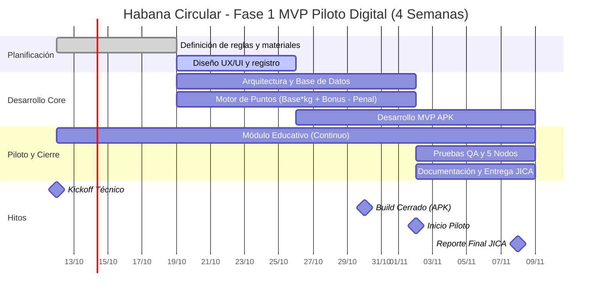

# Habana Circular - Fase 1 MVP Piloto Digital

## Descripción del proyecto

Proyecto de piloto digital para validar una solución de economía circular con incentivos, trazabilidad y participación ciudadana. La primera fase del MVP se enfoca en la operación del sistema de puntos, la interacción del usuario y la validación de 5 nodos en un entorno real.

## Objetivo

Desarrollar una versión funcional del MVP para probar:
- registro e identificación de usuarios
- captura y validación de materiales reciclables
- cálculo de puntos según peso, bonificaciones y penalizaciones
- módulo educativo y comunicación de incentivos
- operación en 5 nodos durante la fase piloto

## Cronograma de trabajo



## Actividades planificadas

### 1. Planificación
- Definición de reglas del sistema
- Definición de materiales aceptados y criterios de clasificación
- Preparación del marco de operación del piloto

### 2. Diseño UX/UI
- Diseño de flujo onboarding y registro
- Wireframes y mockups principales
- Validación de usabilidad con usuarios piloto

### 3. Arquitectura y base de datos
- Definición de entidades principales
- Modelado de usuarios, nodos, materiales y puntos
- Configuración inicial del backend o persistencia

### 4. Motor de puntos
- Lógica de cálculo: Base * kg + Bonus - Penal
- Reglas de bonificación por material o comportamiento
- Penalizaciones por condiciones o inconsistencias

### 5. Desarrollo del MVP APK
- Interfaz principal para registro y captura
- Validación de materiales
- Visualización del balance de puntos y recompensas

### 6. Módulo educativo continuo
- Contenido formativo para reciclaje y uso del sistema
- Mensajes y guías durante la experiencia
- Comunicación en app o canales complementarios

### 7. QA y prueba piloto en 5 nodos
- Validación funcional del MVP
- Pruebas de uso real en nodos piloto
- Ajustes finales según observaciones del piloto

### 8. Documentación y entrega JICA
- Documentación técnica y de operación
- Resumen de resultados del piloto
- Entrega final de evidencias y recomendaciones

## Hitos clave
- 12/10/2026: Kickoff Técnico
- 30/10/2026: Build Cerrado (APK)
- 02/11/2026: Inicio Piloto
- 08/11/2026: Reporte Final JICA

## Estructura sugerida del proyecto

```text
habana-circular-fase1-mvp/
├── README.md
├── docs/
│   ├── gantt.md
│   ├── product-requirements.md
│   └── qa-checklist.md
├── src/
│   ├── app/
│   ├── backend/
│   └── database/
├── assets/
│   ├── ux/
│   └── media/
└── notes/
    └── roadmap.md
```

## Siguiente paso recomendado

1. Definir responsables por actividad
2. Diseñar backlog por sprint
3. Crear tareas técnicas en GitHub Projects
4. Preparar checklist de QA y validación de 5 nodos
