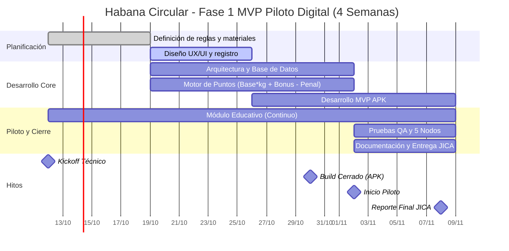

# Diagrama Gantt - Habana Circular

## Visión general

Este documento contiene el cronograma base del proyecto para la Fase 1 del MVP Piloto Digital.

## Observaciones
- El proyecto tiene una duración estimada de 4 semanas.
- La fase core está concentrada entre el 19 de octubre y el 2 de noviembre.
- El piloto y cierre contemplan pruebas, validación y documentación.

## Riesgos a monitorear
- Retrasos en definición de reglas operativas
- Ajustes del motor de puntos durante QA
- Dependencias de materiales y nodos para validación
